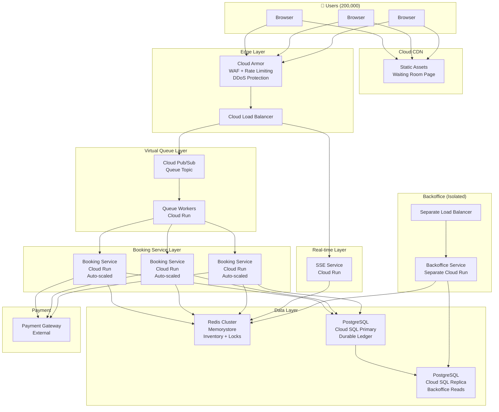
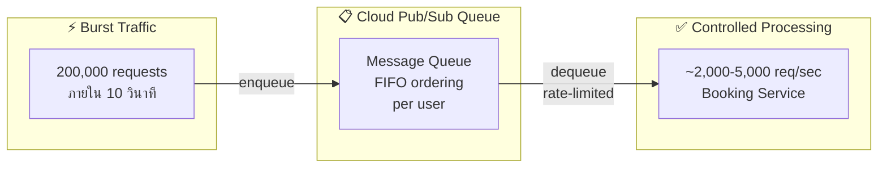
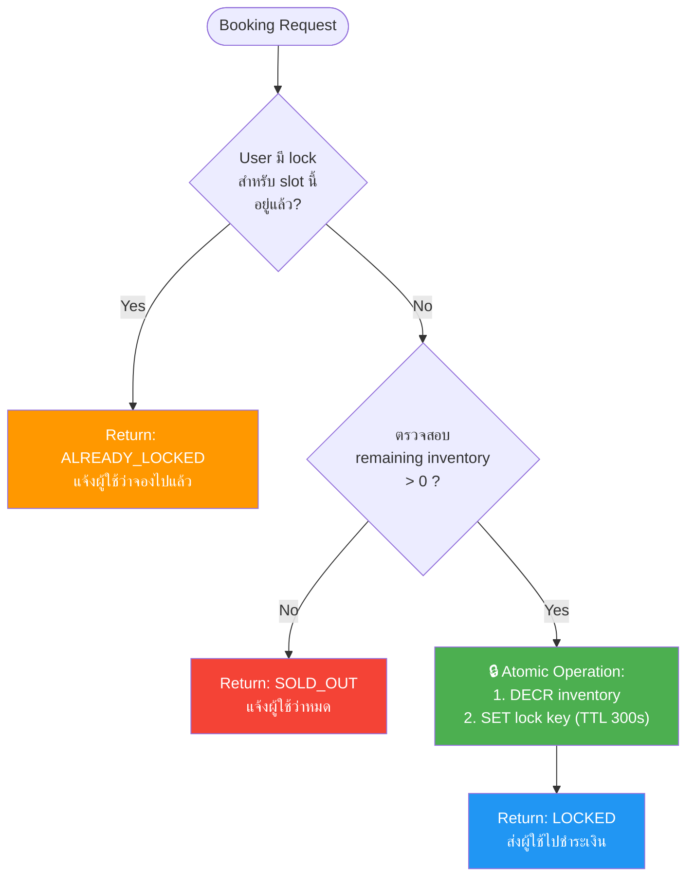
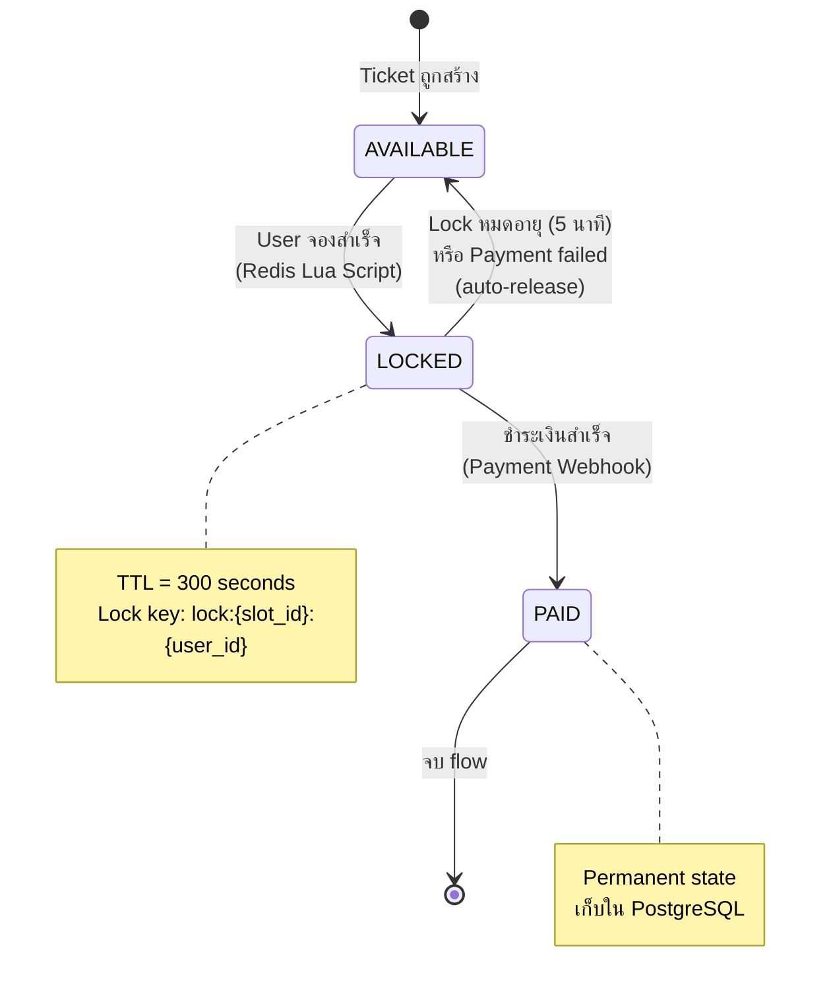
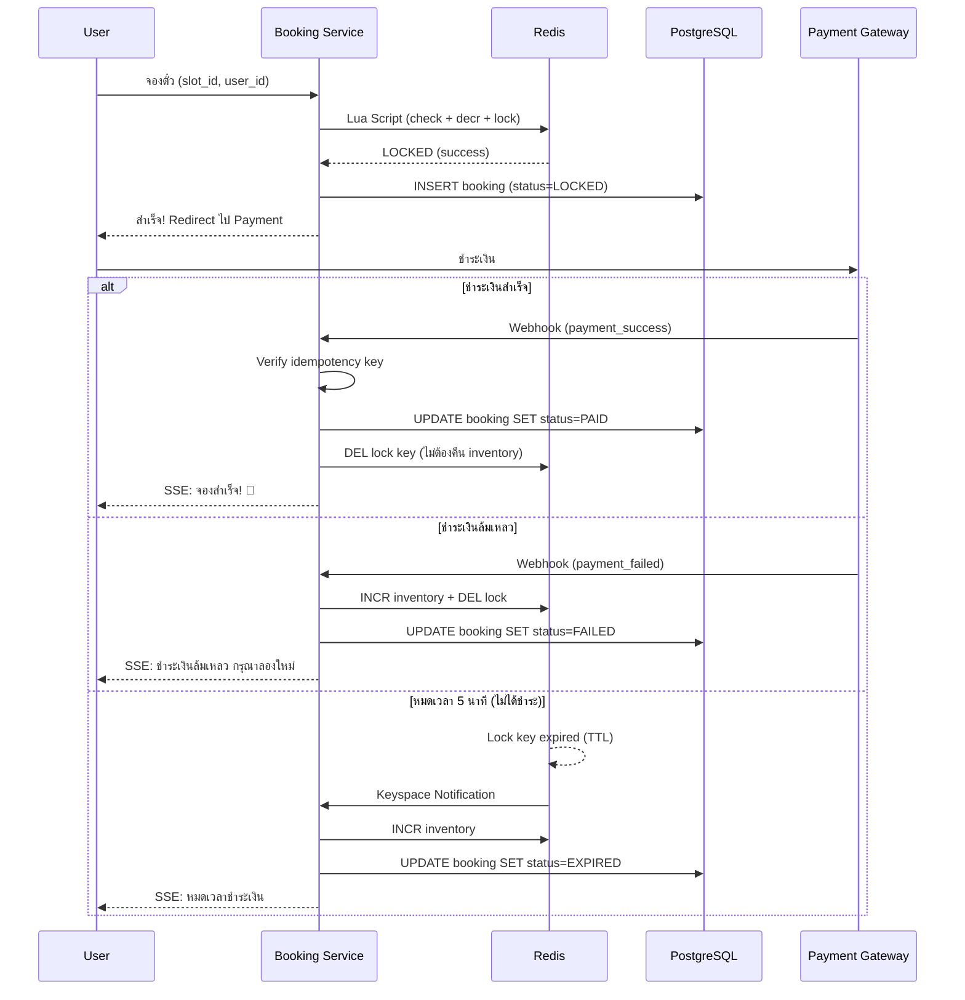
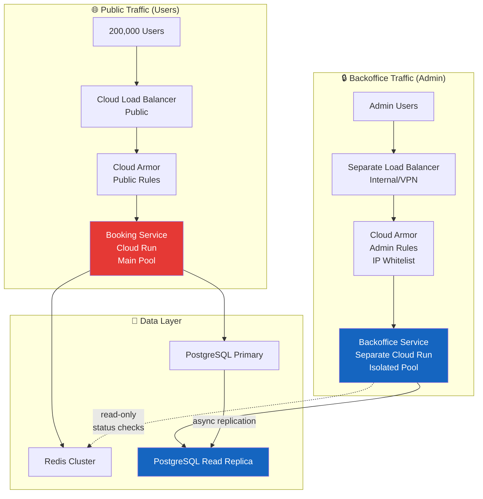
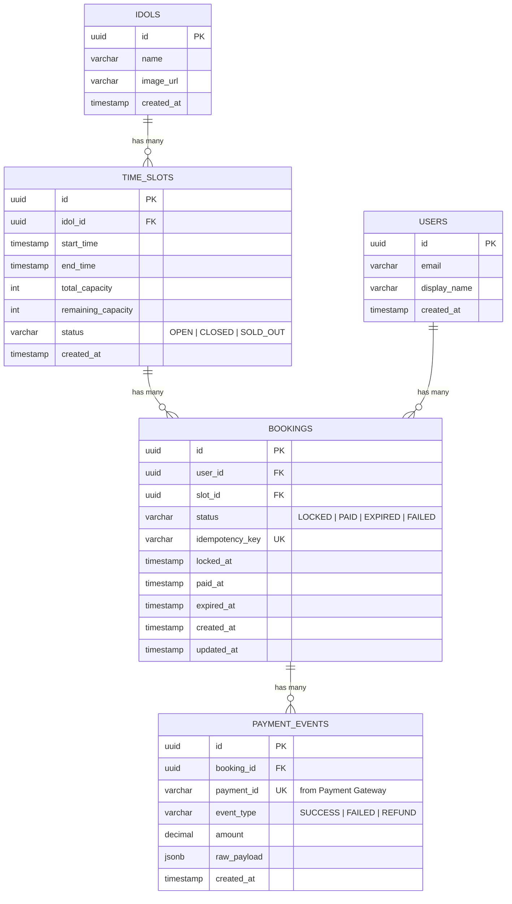

# Architecture Design Document (ADD)
# ระบบจองตั๋วจับมือไอดอล — Idol Handshake Event Ticket Booking

| รายการ | รายละเอียด |
|---|---|
| **Version** | 1.0 |
| **Date** | 2026-03-02 |
| **Status** | Draft |

---

## สารบัญ

1. [บทนำ (Introduction)](#1-บทนำ-introduction)
2. [High-Level System Architecture](#2-high-level-system-architecture)
3. [Core Architecture — Frontend](#3-core-architecture--frontend)
4. [Core Architecture — Backend](#4-core-architecture--backend)
5. [Concurrency & Inventory Management](#5-concurrency--inventory-management)
6. [Payment & Edge Cases](#6-payment--edge-cases)
7. [Backoffice Architecture](#7-backoffice-architecture)
8. [Data Architecture](#8-data-architecture)
9. [Non-Functional Requirements](#9-non-functional-requirements)

---

## 1. บทนำ (Introduction)

### 1.1 Business Requirements

ต้องการพัฒนาระบบจอง "ตั๋วจับมือไอดอล" (Handshake Event) ที่มีไอดอล **50 คน** แต่ละคนมี time slots จำกัด โดยมีแฟนคลับประมาณ **200,000 คน** เปิดเว็บกดจองพร้อมกัน ณ เวลา **10:00:00 น. ตรง** ก่อให้เกิด traffic spike หนักมากในช่วงวินาทีแรก ระบบต้องตอบโจทย์เงื่อนไขทางธุรกิจดังนี้:

**Booking & Inventory**
- แต่ละคนจองได้ **1 ตั๋ว/ไอดอล/รอบ** เท่านั้น
- เมื่อกดจองสำเร็จ ระบบต้อง **ล็อคตั๋ว 5 นาที** เพื่อรอชำระเงินผ่าน Payment Gateway
- หากชำระเงินไม่สำเร็จภายใน 5 นาที ตั๋วต้อง **ถูกปล่อยคืนคลังทันที**
- **ห้ามขายเกินจำนวน (No Overselling)** เด็ดขาด

**Accuracy**
- หน้าเว็บต้องแสดงสถานะตั๋วแบบ Near Real-time: **ว่าง / ล็อค / หมด**
- ยอดเงินต้อง Reconcile กับจำนวนตั๋วที่ขายได้ **100%**

**Backoffice Operations**
- แอดมินต้องดูสถานะการจองของแต่ละคนได้ (เช่น รอชำระเงิน / ชำระแล้ว / ล็อคหมดเวลา)
- การใช้งาน Backoffice **ต้องไม่กระทบ** Performance ของระบบจองหลัก

**Architecture Goals สรุปจาก Business Requirements:**

| Goal | มาจาก Requirement |
|---|---|
| **Zero Overselling** | Booking & Inventory — ห้ามขายเกิน |
| **High Availability** | รับ 200,000 users พร้อมกัน ระบบต้องไม่ล่ม |
| **5-min Lock + Auto-release** | ล็อค 5 นาที แล้วปล่อยคืนอัตโนมัติ |
| **Near Real-time Status** | Accuracy — แสดงสถานะว่าง/ล็อค/หมด |
| **100% Reconciliation** | Accuracy — ยอดเงิน = ตั๋วที่ขาย |
| **Backoffice Isolation** | Backoffice ต้องไม่กระทบระบบหลัก |

### 1.2 ขอบเขต (Scope)

| In Scope | Out of Scope |
|---|---|
| ระบบจองตั๋ว + Virtual Queue | ระบบสมัครสมาชิก / KYC |
| Payment Gateway Integration | ตัว Payment Gateway เอง |
| Backoffice สำหรับ Admin | Mobile App (เฉพาะ Web) |
| Monitoring & Alerting | Marketing / CRM features |

### 1.3 สมมติฐาน (Assumptions)

- ผู้ใช้ทั้ง 200,000 คนลงทะเบียนและ login มาแล้วก่อนเวลาเปิดจอง
- ไอดอล 50 คน แต่ละคนมี time slots จำกัด (สมมติ ~20 slots/คน = ~1,000 slots รวม)
- Payment Gateway มี SLA response time ≤ 10 วินาที
- ใช้ GCP เป็น Cloud Provider หลัก

### 1.4 Glossary

| คำศัพท์ | ความหมาย |
|---|---|
| **Slot** | ช่วงเวลาจับมือ 1 ช่วง ของไอดอล 1 คน |
| **Lock / ล็อค** | สถานะตั๋วที่ถูกจองชั่วคราว รอชำระเงิน (TTL 5 นาที) |
| **Overselling** | การขายตั๋วเกินจำนวนที่มีจริง |
| **Virtual Queue** | ระบบคิวเสมือนที่ควบคุม throughput เข้าสู่ระบบจอง |
| **Idempotency Key** | กุญแจที่ป้องกันการทำ transaction ซ้ำ |
| **Sweeper** | background job ที่คอยตรวจจับและ release lock ที่หมดอายุ |

---

## 2. High-Level System Architecture

### 2.1 System Architecture Diagram



**อธิบายหน้าที่แต่ละ Service:**

| Layer | Service | หน้าที่ |
|---|---|---|
| **CDN** | Cloud CDN | ส่งไฟล์ static (HTML, JS, CSS) ให้ผู้ใช้โดยไม่ต้องผ่าน backend — รวมถึง Waiting Room Page ที่ 200K คนเปิดพร้อมกัน |
| **Edge** | Cloud Armor | ด่านแรกสุด — กรอง bot, จำกัด rate limit, บล็อก DDoS, ตรวจ JWT ก่อนให้เข้าระบบ |
| | Cloud Load Balancer | กระจาย traffic ไปยัง service ปลายทางที่เหมาะสม (Queue, SSE) |
| **Queue** | Cloud Pub/Sub | รับ 200K booking requests แล้วเก็บเข้าคิว — เปลี่ยน burst traffic เป็น stream ที่ควบคุมได้ |
| | Queue Workers | ดึง message จากคิวทีละ batch (5,000/sec) แล้วส่งต่อให้ Booking Service ทำงาน |
| **Booking** | Booking Service | หัวใจหลัก — รัน Redis Lua Script เพื่อจองตั๋ว, บันทึกลง DB, จัดการ payment webhook |
| **Data** | Redis Cluster | เก็บจำนวนตั๋วคงเหลือ + lock key (TTL 5 นาที) — ทำ atomic operation ป้องกัน overselling |
| | PostgreSQL Primary | บันทึกข้อมูลการจองและการชำระเงินถาวร (durable ledger) |
| | PostgreSQL Replica | สำเนา read-only ของ Primary — ให้ Backoffice query โดยไม่กระทบระบบหลัก |
| **Real-time** | SSE Service | push สถานะตั๋ว (ว่าง/ล็อค/หมด) และผลการจองไปยัง browser ของผู้ใช้แบบ real-time |
| **Payment** | Payment Gateway | ระบบชำระเงินภายนอก — รับเงินแล้วส่ง webhook กลับมาบอกผล |
| **Backoffice** | Backoffice Service | ระบบหลังบ้านสำหรับ admin — ดูรายการจอง, สถิติ, export CSV (แยก resource ทั้งหมดจากระบบหลัก) |

### 2.2 Technology Stack

| Layer | Technology | เหตุผล |
|---|---|---|
| **Frontend** | Next.js (Static Export) | SSG (Static Site Generation) สำหรับ waiting room, CDN-friendly |
| **API Gateway / Edge** | Cloud Load Balancer + Cloud Armor | Rate limiting, DDoS protection, JWT validation |
| **Virtual Queue** | Cloud Pub/Sub | รับ burst 200K messages, guaranteed delivery |
| **Backend** | NestJS (Node.js) | NestJS สำหรับ productivity, SSE, Redis |
| **Cache / Lock** | Redis Cluster (Memorystore) | Atomic Lua scripts, sub-ms latency |
| **Database** | PostgreSQL (Cloud SQL) | ACID compliance, durable ledger (อธิบายด้านล่าง) |
| **Real-time** | SSE (Server-Sent Events) | Lightweight, ไม่ต้อง bidirectional เหมือน WebSocket (อธิบายด้านล่าง) |
| **Infrastructure** | GCP Cloud Run | Auto-scaling, pay-per-use, container-based |

#### ทำไมเลือก PostgreSQL? — ACID Compliance & Durable Ledger

**ACID** คือ 4 คุณสมบัติที่ทำให้ database transaction เชื่อถือได้:

| คุณสมบัติ | ความหมาย | ตัวอย่างในระบบนี้ |
|---|---|---|
| **A — Atomicity** | ทำทั้งหมดหรือไม่ทำเลย | `INSERT booking` + `INSERT payment_event` ต้องสำเร็จทั้งคู่ ถ้า payment_event fail → booking ก็ rollback ด้วย |
| **C — Consistency** | ข้อมูลถูกต้องตาม rules เสมอ | UNIQUE constraint `(user_id, slot_id)` → ไม่มีทาง user จอง slot เดียวกัน 2 ครั้ง |
| **I — Isolation** | transaction แต่ละตัวไม่เห็นข้อมูลระหว่างทาง | ถ้า User A กำลัง update booking status → User B query จะเห็นแค่ก่อนหรือหลัง update ไม่เห็นสถานะครึ่งๆ กลางๆ |
| **D — Durability** | สำเร็จแล้วไม่หาย แม้ไฟดับ | booking ที่ status=PAID แล้ว ถึงเครื่อง crash ข้อมูลก็ยังอยู่ |

**Durable Ledger** = บัญชีบันทึกรายการถาวร (เหมือนสมุดบัญชีธนาคาร) ที่ข้อมูลไม่มีวันหาย

```
Redis (ไม่ durable):              PostgreSQL (durable ledger):
┌──────────────────────┐          ┌──────────────────────────┐
│ เร็วมาก (~0.1ms)     │          │ ช้ากว่า (~5ms)            │
│ เก็บใน memory         │          │ เก็บใน disk               │
│ ถ้า crash → ข้อมูลหาย │          │ ถ้า crash → ข้อมูลยังอยู่  │
│ ใช้เป็น "คนกั้นประตู"  │          │ ใช้เป็น "สมุดบัญชีจริง"    │
│                      │          │                          │
│ เหมาะ: inventory count│          │ เหมาะ: booking records    │
│        lock keys     │          │        payment events     │
└──────────────────────┘          └──────────────────────────┘
```

PostgreSQL ทำหน้าที่เป็น durable ledger ในระบบนี้ ใช้สำหรับ:
- **Reconciliation** — ตรวจสอบว่ายอดเงินตรงกับจำนวนตั๋ว 100%
- **Audit trail** — ตรวจย้อนหลังว่าใครจอง เมื่อไหร่ จ่ายเงินเมื่อไหร่
- **Recovery** — ถ้า Redis ล่ม สามารถ rebuild state จาก PostgreSQL ได้

> **สรุป:** ACID compliance + durable ledger = "ข้อมูลการเงินต้องถูกต้อง 100% และไม่มีวันหาย"

#### ทำไมเลือก SSE? — Server-Sent Events สำหรับ Real-time Updates

**SSE (Server-Sent Events)** คือเทคโนโลยีที่ให้ server **push ข้อมูลไปยัง client แบบทางเดียว** ผ่าน HTTP connection ที่เปิดค้างไว้ — client ไม่ต้อง poll ถาม server ซ้ำๆ

```
วิธีดั้งเดิม — Polling (❌ สิ้นเปลือง):
┌────────┐         ┌────────┐
│ Client │──GET──▶│ Server │   ทุก 1 วินาที client ถามซ้ำ
│        │◀─200───│        │   "มีอะไรอัพเดทไหม?" "ยังเหมือนเดิม"
│        │──GET──▶│        │   "มีอะไรอัพเดทไหม?" "ยังเหมือนเดิม"
│        │◀─200───│        │   "มีอะไรอัพเดทไหม?" "ยังเหมือนเดิม"
│        │──GET──▶│        │   → 5,000 คน × 1 req/sec = 5,000 RPS เปล่าๆ
└────────┘         └────────┘

SSE — Server Push (✅ มีประสิทธิภาพ):
┌────────┐         ┌────────┐
│ Client │──GET──▶│ Server │   เปิด connection ค้างไว้ 1 ครั้ง
│        │◀ ─ ─ ─ │        │   server push เฉพาะเมื่อมีข้อมูลใหม่
│        │        │        │   ...รอ...
│        │◀─data──│        │   "Slot 3 → LOCKED!" (push ทันที)
│        │        │        │   ...รอ...
│        │◀─data──│        │   "Slot 7 → SOLD_OUT!" (push ทันที)
└────────┘         └────────┘
```

**ในระบบจองตั๋วนี้ SSE ใช้สำหรับ:**
- Push สถานะตั๋ว 🟢 ว่าง / 🟡 ล็อค / 🔴 หมด เมื่อมีการเปลี่ยนแปลง
- แจ้ง user ว่าถึงคิวแล้ว (Phase 1 → Phase 2)
- แจ้งผลการจอง (LOCKED, SOLD_OUT) และผลการชำระเงิน (PAID, FAILED)

**เปรียบเทียบกับ WebSocket:**

| | SSE | WebSocket |
|---|---|---|
| **ทิศทาง** | ทางเดียว (server → client) | สองทาง (server ↔ client) |
| **Protocol** | HTTP ธรรมดา | Protocol แยกต่างหาก (ws://) |
| **Reconnect** | browser จัดการให้อัตโนมัติ | ต้องเขียน reconnect logic เอง |
| **Load Balancer** | ทำงานกับ HTTP LB ได้เลย | ต้อง config LB รองรับ WebSocket |
| **CDN / Proxy** | ผ่านได้เลย (เป็น HTTP) | บาง proxy block WebSocket |
| **เหมาะกับ** | server push ข้อมูลทางเดียว | chat, game, collaborative editing |

> **ทำไม SSE ไม่ใช่ WebSocket?** ระบบนี้ client ไม่ต้องส่งข้อมูลกลับ server ผ่าน real-time channel (การจองใช้ REST API ปกติ) → ต้องการแค่ **server push ทางเดียว** ซึ่ง SSE ทำได้ง่ายกว่า เบากว่า และทำงานร่วมกับ HTTP infrastructure (CDN, Load Balancer, Cloud Run) ได้ดีกว่า WebSocket

### 2.3 Infrastructure & Pre-warming Strategy

**ทำไมต้อง Pre-warming?**

Cloud Run (และ serverless ทั่วไป) มีปัญหา **Cold Start** — เมื่อ instance ใหม่ถูกสร้างขึ้น ต้องใช้เวลา ~2-5 วินาที ในการ boot container, load dependencies, establish DB/Redis connections ก่อนพร้อมรับ request ในสถานการณ์ปกติ auto-scaling จัดการได้ แต่ในกรณีนี้ **200,000 requests ถล่มเข้ามาในวินาทีเดียวกัน** ณ 10:00:00 น. ตรง ถ้าปล่อยให้ auto-scale เอง:

1. **Cold Start Cascade** — Cloud Run ต้อง spin up instances พร้อมกันหลายร้อยตัว แต่ละตัวใช้เวลา boot → ผู้ใช้กลุ่มแรกเจอ timeout/error
2. **Connection Storm** — instances ใหม่ทั้งหมดพยายาม connect Redis/DB พร้อมกัน → connection pool exhausted
3. **Cascading Failure** — error rate สูง → retry storm → ระบบล่มซ้ำซ้อน

Pre-warming แก้ปัญหาโดย **เตรียม instances ให้พร้อมรับ request ก่อนเวลาเปิดจอง** — ทุก container booted, warm, connections established แล้ว พอ 10:00 น. มาถึง ระบบรับ traffic ได้ทันทีไม่มี delay

```
Timeline:
─────────────────────────────────────────────────────────
09:30  Cloud Run min-instances = 50 (pre-warm)
09:45  Redis Cluster health check, DB connection pool warm-up
09:50  Cloud Run min-instances = 200 (full pre-warm)
09:55  Waiting room page active, queue system ready
09:59  Final health check, monitoring dashboards active
10:00  🔥 เปิดจอง — Virtual Queue accepts requests
10:05  Peak processing
10:15  Traffic decreasing
10:30  Scale down begins, min-instances → 20
11:00  min-instances → 5 (normal operation)
─────────────────────────────────────────────────────────
```

---

## 3. Core Architecture — Frontend

### 3.1 CDN & Static Assets

- **Cloud CDN** serve static assets ทั้งหมด (HTML, JS, CSS, images)
- **Waiting Room Page** เป็น static HTML ที่ CDN serve ได้เลย — ไม่ต้อง hit backend
- Cache policy: `Cache-Control: public, max-age=3600` สำหรับ assets, `no-cache` สำหรับ API calls

### 3.2 User Journey — 2 Phase UX

ผู้ใช้จะเห็น UI ที่แตกต่างกันใน **2 เฟส** เพื่อไม่ให้ขัดแย้งกัน:

```
Phase 1: Queue Screen                  Phase 2: Booking Screen
(ยังไม่ถึงคิว)                           (ถึงคิวแล้ว → เข้าระบบจอง)
┌─────────────────────────┐             ┌─────────────────────────┐
│   🎫 Handshake Event    │             │   🎫 เลือก Slot จอง     │
│                         │             │                         │
│   คุณอยู่ลำดับที่        │             │   Idol: Sakura          │
│   ████████░░  45,231    │             │                         │
│                         │             │   10:00-10:05  🟢 ว่าง  │
│   เวลาโดยประมาณ:        │  ──ถึงคิว──▶│   10:05-10:10  🟡 ล็อค  │
│   ~2-3 นาที             │             │   10:10-10:15  🟢 ว่าง  │
│                         │             │   10:15-10:20  🔴 หมด   │
│   กรุณารอสักครู่...      │             │                         │
│                         │             │   [จองเลย!]             │
└─────────────────────────┘             └─────────────────────────┘
```

**Phase 1: Queue Screen (หน้าคิว)**

ผู้ใช้เข้าเว็บ ณ 10:00 น. → ระบบไม่ได้ส่ง booking request ตรงไป backend แต่จะ:

1. **เข้าคิว** — ส่ง request เข้า Virtual Queue ได้ `queue_position` กลับทันที
2. **แสดงตำแหน่งคิว** — "คุณอยู่ลำดับที่ 45,231"
3. **แสดง estimated wait time** — "ประมาณ 2-3 นาที"
4. **หน้านี้ไม่แสดงสถานะตั๋ว** — เพราะผู้ใช้ยังไม่ได้เข้าถึงระบบจอง ป้องกันการ overload SSE connections 200K พร้อมกัน

**Phase 2: Booking Screen (หน้าจอง — เมื่อถึงคิวแล้ว)**

เมื่อถึงคิว ผู้ใช้ถูก redirect เข้าหน้าเลือก slot:

1. **เห็นสถานะตั๋วแบบ real-time** — 🟢 ว่าง / 🟡 ล็อค / 🔴 หมด
2. **เลือก idol + slot** แล้วกดจอง
3. SSE subscribe ณ จุดนี้ — connection จำนวนจำกัด (~2,000-5,000 คนที่อยู่ใน Phase 2 พร้อมกัน)

> **ทำไมแยก 2 เฟส?** ถ้าให้ 200,000 คนเห็นสถานะตั๋ว real-time พร้อมกันตั้งแต่แรก → SSE 200K connections + ทุกคนกดจอง slot เดียวกันพร้อมกัน → ระบบรับไม่ไหว
> การใช้ Virtual Queue ทำให้มีเพียง ~2,000-5,000 คนที่อยู่ในหน้าจองจริงๆ ในเวลาเดียวกัน ลด load ทั้ง SSE และ Booking Service

### 3.3 Real-time Ticket Status ด้วย SSE (Phase 2 เท่านั้น)

- ใช้ **Server-Sent Events (SSE)** push สถานะตั๋วเฉพาะผู้ใช้ที่ผ่าน Queue แล้ว (Phase 2)
- สถานะที่แสดง: 🟢 ว่าง / 🟡 ล็อค / 🔴 หมด
- Client subscribe ตาม `idol_id` — ได้รับ update เฉพาะไอดอลที่สนใจ
- Concurrent SSE connections จำกัดอยู่ที่ ~2,000-5,000 (ไม่ใช่ 200,000) เพราะ Queue ควบคุม throughput
- SSE reconnect อัตโนมัติเมื่อ connection หลุด (EventSource built-in)

### 3.4 Client-side Protection

| มาตรการ | รายละเอียด |
|---|---|
| **Disable ปุ่มซ้ำ** | ปุ่ม "จอง" ถูก disable ทันทีหลังกด จนกว่าจะได้ response |
| **Debounce** | debounce 1 วินาที ป้องกัน double-click |
| **Optimistic UI** | แสดงสถานะ "กำลังจอง..." ทันที ก่อนรอ response จริง |
| **Graceful Error** | แสดง error message ที่เข้าใจง่าย + retry button (ไม่ auto-retry) |
| **Request ID** | แต่ละ request มี unique ID ป้องกัน duplicate submission |

---

## 4. Core Architecture — Backend

### 4.1 Edge Protection (Cloud Armor)

**Cloud Armor คืออะไร?**

Cloud Armor คือ **เกราะป้องกันชั้นแรกสุด** ที่อยู่หน้า backend ทั้งหมด ทำหน้าที่กรอง traffic ที่ไม่พึงประสงค์ออกก่อนที่จะถึง server — เหมือนรปภ. หน้าตึกที่คัดกรองคนเข้า

```
ไม่มี Cloud Armor:                    มี Cloud Armor:
┌──────────┐                          ┌──────────┐
│ 200K users│                          │ 200K users│
│ + bots   │                          │ + bots   │
│ + DDoS   │                          │ + DDoS   │
└────┬─────┘                          └────┬─────┘
     │ ทุก request                         │
     │ เข้า backend หมด                     ▼
     ▼                                ┌──────────┐
┌──────────┐                          │  Cloud   │ ← กรองที่นี่
│ Backend  │ ← รับไม่ไหว 💥            │  Armor   │
│ ล่ม!     │                          └────┬─────┘
└──────────┘                               │ เฉพาะ traffic ที่ผ่าน
                                           ▼
                                      ┌──────────┐
                                      │ Backend  │ ← รับสบาย ✅
                                      └──────────┘
```

**Cloud Armor Rules อธิบายทีละข้อ:**

| # | Rule | อธิบาย | ป้องกันอะไร |
|---|---|---|---|
| 1 | **Rate Limit: 10 req/sec per IP** | IP เดียวส่ง request ได้ไม่เกิน 10 ครั้ง/วินาที ถ้าเกิน → block ชั่วคราว | Bot/script ที่ยิง request จาก IP เดียวถี่ๆ |
| 2 | **Rate Limit: 5 req/sec per User** | ดึง `user_id` จาก JWT token แล้วจำกัดที่ 5 req/sec ต่อ user — แม้จะเปลี่ยน IP ก็ไม่ช่วย | User ที่เปิดหลาย browser/ใช้ VPN สลับ IP เพื่อยิง request ซ้ำ |
| 3 | **Geo-blocking: TH เท่านั้น** | อนุญาตเฉพาะ request จากประเทศไทย บล็อกที่เหลือทั้งหมด | ลด attack surface — bot farm จากประเทศอื่นเข้าไม่ได้เลย |
| 4 | **Bot Protection: reCAPTCHA Enterprise** | ตรวจพฤติกรรมว่าเป็นคนจริงหรือ bot โดยให้คะแนน (score 0.0-1.0) ไม่ต้องกดรูปภาพ | Bot/script อัตโนมัติที่เขียนมาเพื่อกว้านซื้อตั๋ว (scalper) |
| 5 | **DDoS Protection: Adaptive** | Cloud Armor เรียนรู้ traffic pattern ปกติ แล้วบล็อกอัตโนมัติเมื่อเจอ pattern ผิดปกติ | DDoS attack — ผู้ไม่หวังดีส่ง request ปริมาณมหาศาลเพื่อให้ระบบล่ม |
| 6 | **WAF: OWASP Top 10** | ตรวจจับ pattern การโจมตีที่พบบ่อยที่สุด 10 อันดับ เช่น SQL Injection, XSS | Hacker ที่พยายามแทรก code ผ่าน input เช่น `' OR 1=1 --` หรือ `<script>alert()</script>` |

**ตัวอย่างสถานการณ์จริง:**

```
10:00:00 น. — เปิดจอง

Request เข้ามา 200,000+ ต่อวินาที:
┌─────────────────────────────────────────────────────────┐
│ Cloud Armor กรอง:                                        │
│                                                          │
│  ✅ User ปกติ (กดจอง 1 ครั้ง)           → ผ่าน           │
│  ❌ Bot ยิง 100 req/sec จาก IP เดียว    → บล็อก (Rule 1) │
│  ❌ User เปิด 10 tab กดจองพร้อมกัน      → เกิน 5/sec     │
│                                          → บล็อก (Rule 2) │
│  ❌ Request จาก Russia                   → บล็อก (Rule 3) │
│  ❌ Script อัตโนมัติไม่มี browser         → บล็อก (Rule 4) │
│  ❌ DDoS 500K req/sec จาก botnet        → บล็อก (Rule 5) │
│  ❌ Request มี SQL injection ใน payload  → บล็อก (Rule 6) │
│                                                          │
│  ผลลัพธ์: เฉพาะ request จากคนจริงเข้าถึง backend         │
└─────────────────────────────────────────────────────────┘
```

**JWT Validation ที่ Edge Layer:**
- ทุก request ต้องมี JWT token ที่ถูกต้อง (ได้จากการ login ก่อนเวลาเปิดจอง)
- Cloud Armor ตรวจ JWT **ก่อน** ส่งต่อไป backend — request ที่ไม่มี token หรือ token หมดอายุ ถูก reject ทันที
- ลด load ให้ backend เพราะไม่ต้องตรวจ auth เอง

### 4.2 Virtual Queue Pattern (หัวใจสำคัญ)

Virtual Queue เป็นกลไกหลักที่แปลง **200,000 burst requests** เป็น **steady stream 2,000-5,000 req/sec** เข้าสู่ Booking Service



**ขั้นตอนการทำงาน:**

1. ผู้ใช้กดจอง → API Gateway รับ request → publish ไปยัง Cloud Pub/Sub
2. ผู้ใช้ได้รับ `queue_position` กลับทันที (ภายใน ~50ms)
3. Queue Worker ดึง message ออกมาทีละ batch (pull subscription, max 5,000/sec)
4. Queue Worker เรียก Booking Service เพื่อทำ actual booking
5. ผลลัพธ์ส่งกลับผู้ใช้ผ่าน SSE

### 4.3 Auto-scaling Strategy

**Auto-scaling คืออะไร?**

Auto-scaling คือการที่ Cloud Run **เพิ่ม/ลด จำนวน instances (containers) อัตโนมัติ** ตามปริมาณ traffic ที่เข้ามา — เมื่อ traffic สูง ก็เพิ่ม instance, เมื่อ traffic ลด ก็ลด instance คืน (ประหยัดค่าใช้จ่าย)

```
Auto-scaling Visualization:

Instances
  500 │                    Max ─────────────────────
      │
  200 │        ┌──────┐
      │        │ peak │
  100 │     ┌──┘      └──┐
   50 │─────┘  10:00-10:15 └──┐
   20 │                        └──────┐
    5 │                               └──────────── ปกติ
      └───────────────────────────────────────────
      09:50  10:00  10:10  10:20  10:30  11:00
              ▲
              เปิดจอง
```

**Cloud Run Configuration อธิบายทีละ Service:**

#### Booking Service — หัวใจหลักที่ทำ booking จริง

```
┌─────────────────────────────────────────────────────┐
│ Booking Service:                                     │
│   - Min instances: 50 (pre-warm) → 200 (peak)       │
│   - Max instances: 500                               │
│   - Concurrency: 80 requests/instance                │
│   - CPU: 2 vCPU, Memory: 2 GiB                      │
│   - Scale-up: request count based                    │
└─────────────────────────────────────────────────────┘
```

| Config | ค่า | อธิบาย |
|---|---|---|
| **Min instances** | 50 → 200 | จำนวน instance ขั้นต่ำที่เปิดรอไว้เสมอ (pre-warm ก่อน 10:00) เพื่อไม่ให้เจอ cold start |
| **Max instances** | 500 | จำนวน instance สูงสุดที่ยอมให้ scale ขึ้นไป — เป็น safety cap ป้องกันค่าใช้จ่ายพุ่ง |
| **Concurrency** | 80 req/instance | แต่ละ instance รับได้ 80 requests พร้อมกัน → 500 instances × 80 = **40,000 concurrent requests** |
| **CPU / Memory** | 2 vCPU, 2 GiB | resource ต่อ instance — 2 vCPU เพียงพอสำหรับ I/O-bound work (Redis + DB calls) |

#### Queue Worker — ดึง message จาก Pub/Sub แล้วส่งให้ Booking Service

```
┌─────────────────────────────────────────────────────┐
│ Queue Worker:                                        │
│   - Min instances: 20 (pre-warm) → 100 (peak)       │
│   - Max instances: 200                               │
│   - Pull rate: controlled at 5,000 msg/sec           │
└─────────────────────────────────────────────────────┘
```

| Config | ค่า | อธิบาย |
|---|---|---|
| **Min instances** | 20 → 100 | pre-warm น้อยกว่า Booking Service เพราะ 1 worker ดึง message ทีละ batch ได้เยอะ |
| **Max instances** | 200 | scale ขึ้นได้ถึง 200 ตัว |
| **Pull rate** | 5,000 msg/sec | **จุดสำคัญ** — ควบคุม rate ที่ดึง message ออกจากคิว ไม่ให้เกิน 5,000/sec เพื่อป้องกัน backend overload |

#### SSE Service — ค้าง connection ไว้ push real-time updates

```
┌─────────────────────────────────────────────────────┐
│ SSE Service:                                         │
│   - Min instances: 30 (pre-warm)                     │
│   - Max instances: 300                               │
│   - Concurrency: 1000 connections/instance            │
│   - Timeout: 3600s (long-lived connections)           │
└─────────────────────────────────────────────────────┘
```

| Config | ค่า | อธิบาย |
|---|---|---|
| **Min instances** | 30 | SSE ต้องพร้อมรับ connection ทันทีที่ user เข้า Phase 2 |
| **Max instances** | 300 | 300 × 1,000 = รองรับ **300,000 SSE connections** (เผื่อ headroom) |
| **Concurrency** | 1,000 conn/instance | SSE connection ใช้ CPU น้อยมาก (แค่ค้าง HTTP ไว้) → 1 instance ถือ 1,000 connections ได้สบาย |
| **Timeout** | 3,600s (1 ชั่วโมง) | SSE เป็น long-lived connection — ต้องตั้ง timeout ให้นานพอที่ user จะอยู่ในหน้าจองจนเสร็จ |

> **สรุป:** ทั้ง 3 services มี scaling strategy ต่างกันตามลักษณะงาน — Booking Service ต้อง scale ตาม request count, Queue Worker ต้องคุม pull rate, SSE Service ต้อง scale ตามจำนวน connection

---

## 5. Concurrency & Inventory Management

### 5.1 Redis Lua Script — Atomic Booking Operation

นี่คือหัวใจของการป้องกัน Overselling ทุก operation ต้อง **atomic** ภายใน Redis Lua script เดียว

#### ทำไมต้องใช้ Redis Lua Script?

ในสถานการณ์ที่ 5,000 requests/sec เข้ามาจอง slot เดียวกัน ถ้าเราใช้ approach แบบธรรมดา เช่น:

```
// ❌ วิธีที่ผิด — Non-atomic (มี race condition)
remaining = await redis.get(`inventory:${slotId}`)    // Step A: อ่านค่า
if (remaining > 0) {                                    // Step B: ตรวจสอบ
  await redis.decr(`inventory:${slotId}`)              // Step C: ลดจำนวน
  await redis.set(`lock:${slotId}:${userId}`, ...)     // Step D: สร้าง lock
}
```

**ปัญหา Race Condition (TOCTOU — Time-of-Check to Time-of-Use):**

```
Timeline:
                    ตั๋วเหลือ 1 ใบ
                         │
  User A ─── GET → 1 ──┤                    ← ทั้งคู่อ่านได้ 1
  User B ─── GET → 1 ──┤
                         │
  User A ─── DECR → 0 ─┤                    ← ทั้งคู่ลดค่า
  User B ─── DECR → -1 ┤                    ← 💥 Overselling! ค่าติดลบ
                         │
  ผลลัพธ์: ขายไป 2 ใบ ทั้งที่เหลือ 1 ใบ = Overselling!
```

ระหว่าง Step A กับ Step C มี **time gap** ที่ request อื่นแทรกเข้ามาได้ ทำให้หลาย requests อ่านค่าเดียวกันแล้วลดพร้อมกัน

**Redis Lua Script แก้ปัญหานี้** เพราะ Redis execute Lua script แบบ **single-threaded, blocking** — ไม่มี command อื่นแทรกระหว่างที่ script กำลังทำงาน ทุก step ใน script เป็น atomic operation เดียว

#### Lua Script

```lua
-- KEYS[1] = inventory:{slot_id}       (remaining count)
-- KEYS[2] = lock:{slot_id}:{user_id}  (user lock key)
-- ARGV[1] = user_id
-- ARGV[2] = lock_ttl (300 seconds)
-- ARGV[3] = timestamp

-- Step 1: ตรวจสอบ duplicate — user จองไปแล้วหรือยัง
-- ป้องกัน user กดจองซ้ำ (double-click, retry, etc.)
if redis.call('EXISTS', KEYS[2]) == 1 then
    return {-1, 'ALREADY_LOCKED'}
end

-- Step 2: ตรวจสอบ remaining inventory
-- ถ้า key ไม่มี (nil) หรือ ≤ 0 แปลว่าหมดแล้ว
local remaining = tonumber(redis.call('GET', KEYS[1]))
if remaining == nil or remaining <= 0 then
    return {-2, 'SOLD_OUT'}
end

-- Step 3: Atomic DECR + SET lock
-- DECR ลดจำนวนตั๋ว, SET สร้าง lock key พร้อม TTL 5 นาที
-- ทั้ง 2 commands นี้รันภายใน script เดียว ไม่มี request อื่นแทรกได้
redis.call('DECR', KEYS[1])
redis.call('SET', KEYS[2], ARGV[3], 'EX', tonumber(ARGV[2]))

return {remaining - 1, 'LOCKED'}
```

#### เปรียบเทียบ: ทำไมไม่ใช้วิธีอื่น?

| วิธี | ข้อดี | ข้อเสีย | เหมาะกับกรณีนี้? |
|---|---|---|---|
| **Redis Lua Script** | Atomic, fast (~0.1ms), ไม่มี race condition | ทุก request ต้องผ่าน Redis single-thread | ✅ เหมาะที่สุด — 5,000 req/sec Redis รับได้สบาย |
| **PostgreSQL SELECT FOR UPDATE** | ACID, durable | ช้า (~5-20ms), row lock → contention สูงมากที่ 5K RPS | ❌ ช้าเกินไปสำหรับ hot path |
| **Redis WATCH/MULTI (Optimistic Lock)** | ไม่ต้องเขียน Lua | Retry storm — ที่ 5K RPS เกือบทุก transaction จะ fail + retry วนลูป | ❌ retry rate สูงเกินไป |
| **Application-level Lock (Mutex)** | เข้าใจง่าย | ใช้ได้แค่ single instance, ไม่ work กับ distributed system | ❌ ไม่ work กับ multi-instance |

#### Atomic Guarantee ของ Redis Lua Script

```
เปรียบเทียบกับตัวอย่าง Race Condition ด้านบน:

Timeline (with Lua Script):
                    ตั๋วเหลือ 1 ใบ
                         │
  User A ─── LUA ───────┤  🔒 Redis ล็อค — ไม่มีใครแทรกได้
              │          │     EXISTS? No
              │          │     GET → 1 (> 0 ✅)
              │          │     DECR → 0
              │          │     SET lock
              └──────────┤  🔓 ปลดล็อค — return LOCKED
                         │
  User B ─── LUA ───────┤  🔒 Redis ล็อค
              │          │     EXISTS? No
              │          │     GET → 0 (≤ 0 ❌)
              └──────────┤  🔓 return SOLD_OUT
                         │
  ผลลัพธ์: ขายแค่ 1 ใบ ✅ ไม่มี Overselling!
```

#### Performance ของ Lua Script

| Metric | ค่า |
|---|---|
| **Execution time** | ~0.1ms per script |
| **Throughput** | Redis single-thread รองรับ ~100,000-200,000 ops/sec |
| **Script ของเรา** | ใช้ 3 commands/script → ~50,000-70,000 bookings/sec (เหลือเฟือสำหรับ 5,000/sec) |
| **Memory per lock** | ~150 bytes/key |

> **สรุป:** Redis Lua Script ให้ทั้ง **ความถูกต้อง** (atomic, no race condition) และ **ความเร็ว** (~0.1ms) ซึ่งเป็นสิ่งที่ระบบนี้ต้องการ — ป้องกัน Overselling เด็ดขาดในขณะที่รองรับ throughput สูง

### 5.2 Redis Atomic Operation Flowchart



### 5.3 Lock Mechanism

**Lock Key Format:** `lock:{slot_id}:{user_id}`

| Property | Value |
|---|---|
| **TTL** | 300 วินาที (5 นาที) |
| **Value** | timestamp ที่สร้าง lock |
| **Auto-expire** | Redis จัดการ TTL เอง |

**การปล่อยตั๋วคืน (Release) มี 2 กลไกซ้อนกัน:**

1. **Redis Keyspace Notifications** — เมื่อ key expire, Redis publish event → worker รับ event แล้ว `INCR` inventory กลับ + update PostgreSQL
2. **Scheduled Sweeper (Safety Net)** — ทำงานทุก 30 วินาที, query PostgreSQL หา bookings ที่ status=LOCKED และ created_at + 5min < now, แล้ว release ทั้ง Redis และ DB

```
Dual Safety Net:
┌────────────────────────────────────────────────────────┐
│ Primary: Redis Keyspace Notification (ทันที)           │
│   └─> Key expired → INCR inventory → Update DB        │
│                                                        │
│ Secondary: Sweeper Job (ทุก 30 วินาที)                 │
│   └─> Query DB → Find stale locks → Release all       │
│                                                        │
│ ทำไมต้องมี 2 ชั้น?                                     │
│   - Keyspace notification อาจ miss ได้ (at-most-once)  │
│   - Sweeper เป็น safety net จับ edge case ที่หลุด      │
└────────────────────────────────────────────────────────┘
```

### 5.4 Lock State Machine



### 5.5 Dual-Write Strategy

```
Write Path:
┌──────────────┐     ┌──────────────┐
│    Redis      │     │  PostgreSQL   │
│  (Fast Gate)  │     │  (Durable)    │
├──────────────┤     ├──────────────┤
│ ① DECR inv.  │     │ ③ INSERT      │
│ ② SET lock   │────▶│   booking     │
│              │     │   record      │
└──────────────┘     └──────────────┘
     ~1ms                ~5ms

ลำดับ: Redis ก่อน → สำเร็จแล้วค่อยเขียน PostgreSQL
ถ้า DB write fail → rollback Redis (INCR + DEL lock)
```

- **Redis** = fast gatekeeper, source of truth สำหรับ inventory count
- **PostgreSQL** = durable ledger, source of truth สำหรับ booking records
- ถ้า Redis → DB write fail: rollback ทั้ง Redis (INCR inventory + DEL lock)

---

## 6. Payment & Edge Cases

### 6.1 Payment Flow



### 6.2 Idempotency

**Idempotency คืออะไร?**

Idempotency คือคุณสมบัติที่ว่า **ทำ operation เดิมซ้ำกี่ครั้งก็ได้ผลลัพธ์เหมือนกันทุกครั้ง** — ไม่มีผลข้างเคียงเพิ่มเติม

```
ตัวอย่างในชีวิตจริง:

✅ Idempotent:
  - กดปุ่มลิฟท์ชั้น 5 → ลิฟท์ไปชั้น 5
  - กดปุ่มลิฟท์ชั้น 5 อีกครั้ง → ลิฟท์ก็ยังไปชั้น 5 (ไม่ได้ไปชั้น 10)

❌ ไม่ Idempotent:
  - โอนเงิน 100 บาท → ยอดหัก 100
  - โอนเงิน 100 บาท อีกครั้ง → ยอดหัก 200 💥 (ซ้ำ!)
```

**ทำไมต้องมี Idempotency ในระบบนี้?**

Payment Gateway อาจส่ง **webhook ซ้ำ** มาหา Booking Service ได้หลายสาเหตุ:

```
สาเหตุที่ webhook มาซ้ำ:
┌─────────────────────────────────────────────────────────┐
│ 1. Gateway retry — ส่ง webhook แล้วไม่ได้ 200 กลับ       │
│    (network timeout) → ส่งซ้ำอีกครั้ง                     │
│                                                          │
│ 2. Duplicate delivery — Gateway ส่ง webhook สำเร็จ        │
│    แต่ internal system ส่งซ้ำอีก (at-least-once delivery) │
│                                                          │
│ 3. User กดชำระซ้ำ — กดปุ่มจ่ายเงิน 2 ครั้ง               │
│    → Gateway สร้าง 2 payment events                      │
└─────────────────────────────────────────────────────────┘

ถ้าไม่มี idempotency:
  Webhook ครั้งที่ 1: UPDATE booking = PAID   ✅ ถูกต้อง
  Webhook ครั้งที่ 2: UPDATE booking = PAID   ← ทำซ้ำ!
                       INSERT payment_event    ← ซ้ำ! ยอดเงินผิด!

ถ้ามี idempotency:
  Webhook ครั้งที่ 1: UPDATE booking = PAID   ✅ ถูกต้อง
  Webhook ครั้งที่ 2: payment_id ซ้ำ → return 200 (no-op) ✅ ไม่ทำอะไร
```

**กลไก Idempotency ในระบบนี้:**

ทุก payment webhook จาก Gateway จะมี **`payment_id`** ที่ไม่ซ้ำกันติดมาด้วย — ใช้เป็น idempotency key:

```
Idempotency Check Flow:
┌────────────────────────────────────────────────────────┐
│ 1. Payment Gateway ส่ง webhook พร้อม payment_id        │
│                                                        │
│ 2. Booking Service ตรวจ payment_events table           │
│    - ถ้ามี payment_id อยู่แล้ว → return 200 (no-op)   │
│      ไม่ UPDATE อะไรเพิ่ม ไม่สร้าง record ซ้ำ          │
│    - ถ้าไม่มี → process + INSERT payment_event         │
│                                                        │
│ 3. INSERT ใช้ UNIQUE constraint บน payment_id          │
│    → แม้ 2 webhooks มาถึงพร้อมกัน (race condition)     │
│      ตัวที่สองจะ fail ที่ UNIQUE constraint → no-op    │
└────────────────────────────────────────────────────────┘
```

**ป้องกัน 2 ชั้น:**

| ชั้น | กลไก | ป้องกันอะไร |
|---|---|---|
| **ชั้นที่ 1: Application check** | `SELECT` หา payment_id ก่อน — ถ้ามีแล้ว return 200 ทันที | Webhook ที่มาซ้ำห่างกัน (เช่น retry หลัง 5 วินาที) |
| **ชั้นที่ 2: DB UNIQUE constraint** | `UNIQUE (payment_id)` บน payment_events table — INSERT ซ้ำ error | Webhook ที่มาถึง **พร้อมกัน** (concurrent) — ชั้นที่ 1 ผ่านทั้งคู่เพราะ SELECT พร้อมกัน แต่ INSERT ตัวที่ 2 จะ fail |

```
Timeline — 2 webhooks มาพร้อมกัน:

  Webhook A ─── SELECT payment_id ──▶ ไม่มี ─── INSERT ✅ สำเร็จ
  Webhook B ─── SELECT payment_id ──▶ ไม่มี ─── INSERT ❌ UNIQUE violation
                                                         → catch error
                 (ทั้งคู่ SELECT พร้อมกัน                    → return 200
                  เลยผ่านชั้นที่ 1 ทั้งคู่)                   → no-op ✅
```

> **สรุป:** Idempotency ทำให้ระบบ **ปลอดภัยต่อ webhook ซ้ำ** — ไม่ว่า Gateway จะส่งกี่ครั้ง ผลลัพธ์ก็จะเหมือนส่งครั้งเดียว ยอดเงินไม่ผิด booking ไม่ซ้ำ

### 6.3 Edge Case Matrix

| กรณี | สาเหตุ | การจัดการ | ผลลัพธ์ |
|---|---|---|---|
| **Payment Timeout** | ผู้ใช้ไม่ชำระภายใน 5 นาที | Redis TTL expire → Keyspace Notification + Sweeper | ตั๋วถูก release คืนคลัง |
| **Gateway Failed** | Payment Gateway ส่ง error กลับ | Release ตั๋วทันที + แจ้ง user ให้ลองใหม่ | ตั๋วถูก release, user จองใหม่ได้ |
| **Double Webhook** | Gateway ส่ง webhook ซ้ำ 2 ครั้ง | Idempotency check ด้วย payment_id UNIQUE constraint | Process ครั้งแรก, ครั้งที่ 2 เป็น no-op |
| **Webhook Lost** | Network issue ทำให้ไม่ได้รับ webhook | Sweeper job query Payment Gateway API ทุก 30 วินาที | Sweeper ตรวจพบและ update สถานะ |
| **Late Payment** | ชำระเงินหลัง lock expired + ตั๋วถูกขายไปแล้ว | ตรวจสอบ slot availability → ถ้าหมดแล้ว → trigger refund | ผู้ใช้ได้เงินคืน |
| **Redis Down** | Redis cluster failure | Circuit breaker → fallback ไป DB-only mode (ช้าแต่ถูกต้อง) | ระบบทำงานต่อได้แบบ degraded |
| **DB Write Failed** | PostgreSQL connection issue | Rollback Redis (INCR + DEL lock) → retry หรือแจ้ง user | ไม่มี inconsistency |

### 6.4 Reconciliation

**Reconciliation คืออะไร?**

Reconciliation คือ **การกระทบยอด** — เอาข้อมูลจากหลายแหล่งมาเทียบกัน เพื่อยืนยันว่า **ตัวเลขตรงกัน 100%** ไม่มีเงินหาย ไม่มีตั๋วหลุด เหมือนกับการที่ร้านค้าปิดร้านแล้วนับเงินในลิ้นชักเทียบกับใบเสร็จ

```
ตัวอย่างในชีวิตจริง:

ร้านขายตั๋ว:
  ตั๋วทั้งหมด          = 1,000 ใบ
  ตั๋วขายไปแล้ว (PAID)  =   800 ใบ
  ตั๋วถูก lock อยู่      =    50 ใบ
  ตั๋วคงเหลือ (ว่าง)    =   150 ใบ
                         ─────────
  รวม                   = 1,000 ใบ  ✅ ตรง!

เงินที่ต้องได้:
  800 ใบ × 500 บาท     = 400,000 บาท
  เงินจาก Gateway       = 400,000 บาท  ✅ ตรง!

ถ้าไม่ตรง → 🚨 มีปัญหา! ต้อง investigate
```

**ทำไมต้อง Reconcile?**

ระบบนี้มีข้อมูลอยู่ **3 แหล่ง** ที่ต้องตรงกัน:

```
┌──────────────┐   ┌──────────────┐   ┌──────────────┐
│    Redis      │   │  PostgreSQL   │   │   Payment    │
│               │   │               │   │   Gateway    │
│ ตั๋วคงเหลือ   │   │ booking       │   │              │
│ = 150         │   │ records       │   │ settlements  │
│               │   │ PAID = 800    │   │ = 400,000 ฿  │
│               │   │ LOCKED = 50   │   │              │
└──────┬───────┘   └──────┬───────┘   └──────┬───────┘
       │                  │                   │
       └──────────┬───────┘                   │
                  │                           │
            ต้องตรงกัน ✅                  ต้องตรงกัน ✅
        150 + 800 + 50 = 1,000          800 × 500 = 400,000
```

ถ้าข้อมูล 3 แหล่งไม่ตรงกัน หมายความว่าอาจเกิดปัญหา เช่น:
- **ตั๋ว oversold** — ขายไปมากกว่าที่มี (Redis inventory ติดลบ)
- **เงินหาย** — Gateway เก็บเงินแล้วแต่ booking ยังเป็น LOCKED
- **Lock ค้าง** — lock หมดอายุแล้วแต่ inventory ไม่ถูก INCR กลับ

**Reconciliation Strategy — 2 ระดับ:**

#### ระดับที่ 1: Real-time (ทุก webhook)

ตรวจสอบทันทีเมื่อได้รับ payment webhook แต่ละครั้ง:

```
ทุกครั้งที่ได้รับ webhook:
┌─────────────────────────────────────────────────────────┐
│ ✅ Check 1: payment amount = ticket price               │
│    เช่น webhook บอกจ่าย 500 บาท = ราคาตั๋ว 500 บาท?    │
│    ถ้าไม่ตรง → 🚨 Alert ทันที + ไม่ confirm booking      │
│                                                          │
│ ✅ Check 2: booking status transition ถูกต้อง            │
│    LOCKED → PAID        ✅ ถูกต้อง                       │
│    LOCKED → FAILED      ✅ ถูกต้อง                       │
│    PAID → PAID          ⚠️ duplicate webhook → no-op     │
│    EXPIRED → PAID       ⚠️ late payment → ตรวจ inventory │
│    AVAILABLE → PAID     ❌ ผิดปกติ! → 🚨 Alert           │
│                                                          │
│ ✅ Check 3: webhook signature ถูกต้อง                    │
│    ป้องกัน fake webhook จาก attacker                     │
└─────────────────────────────────────────────────────────┘
```

#### ระดับที่ 2: Batch Daily (ทุกวัน 02:00 น.)

กระทบยอดรวมทั้งวัน เพื่อจับ edge cases ที่ real-time check อาจพลาด:

```
Daily Reconciliation Job (02:00 น.):
┌─────────────────────────────────────────────────────────┐
│                                                          │
│ ✅ Check A: Inventory Balance                            │
│    สูตร: ตั๋วคงเหลือ(Redis) + ตั๋ว PAID(DB)             │
│           + ตั๋ว LOCKED(DB) = ตั๋วทั้งหมด(total_capacity)│
│                                                          │
│    ตัวอย่าง: 150 + 800 + 50 = 1,000 ✅                   │
│    ถ้าไม่ตรง → 🚨 CRITICAL Alert                         │
│                                                          │
│ ✅ Check B: Revenue Match                                │
│    สูตร: จำนวน PAID bookings(DB) × ราคาตั๋ว              │
│           = ยอดเงินจาก Gateway settlements               │
│                                                          │
│    ตัวอย่าง: 800 × 500 = 400,000 บาท                    │
│              Gateway settlements = 400,000 บาท ✅         │
│    ถ้าไม่ตรง → 🚨 CRITICAL Alert + ตรวจ refund cases    │
│                                                          │
│ ✅ Check C: Stale Lock Cleanup                           │
│    หา booking ที่ status=LOCKED แต่เก่ากว่า 5 นาที        │
│    ถ้ามี → Sweeper พลาด → force release + alert          │
│                                                          │
│ ✅ Check D: Orphan Payment Events                        │
│    หา payment_events ที่ไม่มี booking ตรงกัน              │
│    ถ้ามี → 🚨 Alert + manual investigation               │
│                                                          │
│ Output: สร้าง Reconciliation Report                      │
│         ส่งให้ทีม Finance + Admin ทุกเช้า                 │
└─────────────────────────────────────────────────────────┘
```

**ทำไมต้องมีทั้ง Real-time และ Daily?**

| | Real-time | Daily Batch |
|---|---|---|
| **เมื่อไหร่** | ทุก webhook ทันที | ทุกวัน 02:00 น. |
| **ตรวจอะไร** | ความถูกต้องของแต่ละ transaction | ยอดรวมทั้งระบบ |
| **จับอะไรได้** | จำนวนเงินผิด, status transition ผิด | Inventory ไม่ balance, เงินหาย, lock ค้าง |
| **จับอะไรไม่ได้** | ปัญหาที่ไม่มี webhook มาเลย (เช่น webhook lost) | ต้องรอถึงวันรุ่งขึ้น |

> **สรุป:** Real-time reconciliation จับปัญหาเฉพาะจุดได้ทันที แต่ Daily batch คือ **safety net สุดท้าย** ที่มองภาพรวมทั้งระบบ — ทั้ง 2 ระดับทำงานร่วมกันจึงรับประกันได้ว่ายอดเงิน reconcile กับจำนวนตั๋ว **100%** ตาม requirement

---

## 7. Backoffice Architecture

### 7.1 Backoffice Isolation Diagram



#### PostgreSQL Read Replica คืออะไร?

**Read Replica** คือ สำเนาของ database หลัก (Primary) ที่ **รับได้เฉพาะการอ่าน (SELECT) เท่านั้น** ไม่สามารถเขียน (INSERT/UPDATE/DELETE) ได้ โดย Primary จะส่งข้อมูลที่เปลี่ยนแปลงไปยัง Replica แบบ **async replication** อัตโนมัติ

```
การทำงานของ Read Replica:

┌─────────────────┐    async replication    ┌─────────────────┐
│  PostgreSQL      │  ───────────────────▶  │  PostgreSQL      │
│  Primary         │    (ส่งข้อมูลที่เปลี่ยน   │  Read Replica    │
│                  │     ไปตลอดเวลา)         │                  │
│  ✅ อ่านได้       │                        │  ✅ อ่านได้       │
│  ✅ เขียนได้      │                        │  ❌ เขียนไม่ได้   │
│                  │                        │                  │
│  ใช้โดย:         │                        │  ใช้โดย:         │
│  Booking Service │                        │  Backoffice      │
│  (200K users)    │                        │  (Admin 5-10 คน) │
└─────────────────┘                        └─────────────────┘
```

**ทำไมต้องใช้ Read Replica สำหรับ Backoffice?**

ถ้า Backoffice query ตรงไปที่ Primary DB เดียวกับระบบจอง:

```
❌ ไม่มี Read Replica:
┌─────────────────────────────────────────────────────────┐
│  PostgreSQL Primary                                      │
│                                                          │
│  Booking Service: INSERT 5,000 rows/sec  ─┐              │
│                                           ├─▶ แย่ง       │
│  Admin: SELECT * FROM bookings            ─┘   connection │
│         WHERE idol_id = '...'                  + CPU      │
│         ORDER BY created_at DESC                          │
│                                                          │
│  → Admin query ช้า = ไม่เป็นไร                            │
│  → แต่ Admin query ใช้ CPU/IO → Booking INSERT ช้าลง!    │
│  → 💥 กระทบ Performance ระบบจองหลัก                       │
└─────────────────────────────────────────────────────────┘

✅ มี Read Replica:
┌──────────────────────┐    ┌──────────────────────┐
│  PostgreSQL Primary   │    │  PostgreSQL Replica   │
│                       │    │                       │
│  Booking Service ONLY │    │  Backoffice ONLY      │
│  INSERT 5,000 rows/s  │    │  SELECT queries       │
│                       │    │  heavy reports         │
│  ไม่มีใครมาแย่ง       │    │  CSV export            │
│  resource ✅           │    │                       │
└──────────────────────┘    └──────────────────────┘
  → แยกกันสมบูรณ์ ไม่กระทบกัน
```

**Replication Lag:**
- ข้อมูลใน Replica อาจ **ช้ากว่า Primary 100-500ms** (async replication)
- สำหรับ Backoffice ที่ admin ดูรายงาน เรื่อง lag ไม่กี่ร้อย ms ไม่มีผลกระทบ
- แต่ถ้าต้องการข้อมูล real-time จริงๆ (เช่น ตั๋วคงเหลือ) → อ่านจาก Redis แทน (ซึ่ง Backoffice ทำอยู่แล้ว)

### 7.2 Resource Isolation Details

**ทำไมต้อง "แยก Resource"?**

Requirement บอกชัดเจนว่า Backoffice **ต้องไม่กระทบ** Performance ของระบบจองหลัก — วิธีที่ดีที่สุดคือ **แยกทุกอย่างออกจากกันตั้งแต่ต้นทาง** ไม่ให้ traffic ของ Admin และ User ใช้ resource เดียวกันเลย

```
ถ้าใช้ resource ร่วมกัน (❌):
┌─────────────────────────────────────────────────────────┐
│                  Shared Cloud Run                        │
│                                                          │
│  User request (5,000/sec) ─┐                             │
│                            ├─▶ แย่ง CPU, Memory, Threads │
│  Admin export CSV ─────────┘   Admin ทำให้ User ช้าลง!  │
│  (query หนัก 10 วินาที)                                  │
│                                                          │
│  💥 Admin กด export → Booking latency พุ่ง               │
└─────────────────────────────────────────────────────────┘

ถ้าแยก resource (✅):
┌──────────────────────┐    ┌──────────────────────┐
│  Booking Cloud Run    │    │  Backoffice Cloud Run │
│  (users only)         │    │  (admin only)         │
│                       │    │                       │
│  5,000 req/sec        │    │  Admin export CSV     │
│  ไม่มี Admin มายุ่ง   │    │  query หนักแค่ไหน     │
│  performance คงที่ ✅  │    │  ก็ไม่กระทบ User ✅    │
└──────────────────────┘    └──────────────────────┘
```

**อธิบายทีละ Resource ที่แยก:**

| Resource | Public (Booking) | Backoffice (Admin) | ทำไมต้องแยก |
|---|---|---|---|
| **Load Balancer** | Public CLB | Separate Internal CLB | Admin เข้าผ่าน internal network / VPN เท่านั้น — ไม่เปิดให้ public เข้าถึง ปลอดภัยกว่า + traffic ไม่ปนกัน |
| **Cloud Armor** | Rate limit per user | IP whitelist only | User ต้องป้องกัน bot/DDoS แต่ Admin ใช้ IP whitelist เพราะรู้ตัวตนแน่นอน — rule set ต่างกันสิ้นเชิง |
| **Cloud Run** | Booking Service (auto-scale 50-500) | Backoffice Service (2-10 instances) | **จุดสำคัญที่สุด** — ถ้าใช้ร่วมกัน Admin query หนักๆ (เช่น export CSV 100K rows) จะแย่ง CPU/Memory กับ booking requests |
| **Database** | Cloud SQL Primary (read/write) | Cloud SQL Read Replica (read-only) | Admin query (SELECT with JOIN, GROUP BY, ORDER BY) ใช้ CPU + I/O สูง — ถ้าทำบน Primary จะแย่งกับ INSERT 5,000/sec ของ Booking |
| **Connection Pool** | Max 100 connections | Max 20 connections (separate pool) | DB connection มีจำกัด — ถ้า Admin ใช้ connection จาก pool เดียวกัน อาจทำให้ Booking Service ไม่มี connection ใช้ |
| **Redis** | Full access (read/write) | Read-only access | Admin ต้องการแค่ดูข้อมูล (ตั๋วคงเหลือ, สถิติ) ไม่จำเป็นต้องเขียน — read-only ลดความเสี่ยงที่จะเปลี่ยนข้อมูลโดยไม่ตั้งใจ |
| **Rate Limit** | 5 req/sec per user | 50 req/sec per admin (relaxed) | User ต้องจำกัดเข้มเพราะมี 200K คน แต่ Admin มีแค่ 5-10 คน → ผ่อนปรน rate limit ให้ทำงานสะดวก |

```
สรุป: Request Path แยกกัน 100%

User Path:
  Browser → Public CLB → Cloud Armor (user rules)
          → Booking Cloud Run → Redis (read/write) → DB Primary

Admin Path:
  Browser → Internal CLB → Cloud Armor (IP whitelist)
          → Backoffice Cloud Run → Redis (read-only) → DB Replica

→ ไม่มี resource ไหนที่ใช้ร่วมกันเลย (ยกเว้น Redis read-only)
→ Admin ทำอะไรก็ไม่กระทบ User เด็ดขาด ✅
```

### 7.3 Backoffice Features

| Feature | รายละเอียด | Data Source |
|---|---|---|
| **Booking List** | ดูรายการจองทั้งหมด พร้อม filter (idol, status, time) | DB Read Replica |
| **Booking Status** | ดูสถานะ: LOCKED / PAID / EXPIRED / FAILED | DB Read Replica |
| **Real-time Stats** | จำนวนตั๋วคงเหลือ, ยอดขาย, conversion rate | Redis (read-only) |
| **Manual Release** | ปล่อยตั๋วที่ lock ค้าง (emergency) | Redis + DB Primary* |
| **Reconciliation Report** | รายงาน daily reconciliation | DB Read Replica |
| **CSV Export** | Export ข้อมูลการจองเป็น CSV | DB Read Replica |

> *Manual Release เป็น operation เดียวที่ Backoffice ต้องเขียนไปที่ Redis + DB Primary (ผ่าน dedicated API endpoint ที่มี rate limit แยก)

---

## 8. Data Architecture

### 8.1 ERD (Entity Relationship Diagram)



### 8.2 Key Constraints

```sql
-- ป้องกัน 1 user จอง 1 idol/slot ได้ครั้งเดียว
ALTER TABLE bookings
    ADD CONSTRAINT uq_user_slot
    UNIQUE (user_id, slot_id);

-- ป้องกัน duplicate payment processing
ALTER TABLE payment_events
    ADD CONSTRAINT uq_payment_id
    UNIQUE (payment_id);

-- Index สำหรับ Sweeper query
CREATE INDEX idx_bookings_stale_locks
    ON bookings (status, locked_at)
    WHERE status = 'LOCKED';

-- Index สำหรับ Backoffice queries
CREATE INDEX idx_bookings_idol_status
    ON bookings (slot_id, status);
```

### 8.3 Redis Data Structures

| Key Pattern | Type | TTL | ใช้งาน |
|---|---|---|---|
| `inventory:{slot_id}` | String (integer) | ไม่มี | จำนวนตั๋วคงเหลือ |
| `lock:{slot_id}:{user_id}` | String (timestamp) | 300s | Lock ของ user |
| `slot:status:{slot_id}` | Hash | ไม่มี | สถานะ slot (สำหรับ SSE broadcast) |
| `queue:position` | Sorted Set | ไม่มี | ตำแหน่งคิว Virtual Queue |

---

## 9. Non-Functional Requirements

### 9.1 Availability & SLA

| Metric | Target |
|---|---|
| **Availability** | 99.9% (ช่วง event: 99.99%) |
| **Booking API Latency** | p95 < 200ms (จาก queue → response) |
| **Queue Enqueue Latency** | p99 < 100ms |
| **SSE Update Latency** | < 2 วินาที |
| **Recovery Time (RTO)** | < 5 นาที |
| **Recovery Point (RPO)** | 0 (zero data loss สำหรับ payment) |

### 9.2 Monitoring & Alerting

**Monitoring คืออะไร?**

Monitoring คือการ **เฝ้าดูสุขภาพของระบบแบบ real-time** — เก็บตัวเลข (metrics) จากทุก service แล้วแสดงบน dashboard เพื่อให้ทีมเห็นว่าระบบทำงานปกติหรือมีปัญหา

**Alerting คืออะไร?**

Alerting คือการ **แจ้งเตือนอัตโนมัติ** เมื่อ metrics เกินค่าที่กำหนด — ไม่ต้องมีคนนั่งจ้องหน้าจอตลอดเวลา ระบบแจ้งเองเมื่อมีปัญหา

```
Monitoring + Alerting ทำงานร่วมกัน:

  ระบบทำงานอยู่ → เก็บ metrics ตลอดเวลา → แสดงบน Dashboard
                                          ↓
                                    metrics เกินค่า?
                                    ↓            ↓
                                   No           Yes
                                    ↓            ↓
                              ปกติ ✅      🚨 ส่ง Alert!
                                          → PagerDuty (โทรปลุก)
                                          → Slack (แจ้งทีม)
```

**ทำไมสำคัญกับระบบนี้?**

ระบบจองตั๋วมี **window เวลาสั้นมาก** (~10-15 นาที ตั้งแต่เปิดจองจนตั๋วหมด) ถ้ามีปัญหาเกิดขึ้นแล้วไม่รู้ทันที → แฟนคลับ 200,000 คนจะเจอ error → เสียหายทั้ง business และ reputation ดังนั้นต้อง **รู้ปัญหาภายในวินาที ไม่ใช่นาที**

#### Metrics — ตัวเลขที่ต้องเฝ้าดู

| หมวด | Metrics | ทำไมต้องดู |
|---|---|---|
| **API** | Request rate, Error rate, Latency (p50/p95/p99) | p50 = คน 50% ได้ response ภายในเท่าไหร่, p99 = คน 99% ได้ภายในเท่าไหร่ — ถ้า p99 สูง แปลว่ามีบาง request ช้ามาก |
| **Redis** | Memory usage, Hit rate, Eviction count | ถ้า memory เต็ม → Redis จะ evict (ลบ) keys ออก → lock หาย → ตั๋วรั่ว! |
| **Database** | Active connections, Query latency, Replication lag | ถ้า connection เต็ม → Booking Service เขียน DB ไม่ได้, Replication lag สูง → Backoffice เห็นข้อมูลเก่า |
| **Queue** | Queue depth, Processing rate, Consumer lag | Queue depth = จำนวน message ที่ยังไม่ถูก process — ถ้าสูงขึ้นเรื่อยๆ แปลว่า consumer ทำงานไม่ทัน |
| **Business** | Inventory levels per slot (remaining count) | ตัวเลขที่สำคัญที่สุดทาง business — ตั๋วแต่ละ idol เหลือเท่าไหร่ ขายไปเท่าไหร่ |

#### Alerting — แจ้งเตือนเมื่อไหร่

แบ่งเป็น 2 ระดับ: **CRITICAL** (ต้องแก้ทันที) และ **WARNING** (ควรดูแต่ยังไม่วิกฤต)

```
🔴 CRITICAL Alerts → PagerDuty (โทรศัพท์ปลุก on-call engineer)
┌─────────────────────────────────────────────────────────┐
│                                                          │
│  Error rate > 5%                                         │
│  → requests 1 ใน 20 fail → ผู้ใช้จำนวนมากจองไม่ได้      │
│  → ต้อง investigate ทันที                                │
│                                                          │
│  Redis memory > 90%                                      │
│  → ใกล้เต็ม ถ้า 100% จะเริ่ม evict keys                  │
│  → lock keys อาจหาย → ตั๋วรั่ว!                          │
│                                                          │
│  Inventory mismatch detected                             │
│  → Redis inventory + DB bookings ≠ total capacity        │
│  → อาจเกิด overselling หรือ lock ค้าง                    │
│  → ต้องตรวจสอบทันที                                      │
│                                                          │
└─────────────────────────────────────────────────────────┘

🟡 WARNING Alerts → Slack (แจ้งทีมใน channel)
┌─────────────────────────────────────────────────────────┐
│                                                          │
│  Latency p95 > 500ms                                     │
│  → ระบบเริ่มช้า แต่ยังทำงานได้                           │
│  → อาจเป็นสัญญาณว่ากำลังจะมีปัญหาใหญ่                  │
│                                                          │
│  Queue depth > 100,000                                   │
│  → คิวยาวมาก ผู้ใช้รอนาน                                │
│  → อาจต้อง scale up queue workers                        │
│                                                          │
│  DB replication lag > 5 seconds                          │
│  → Backoffice เห็นข้อมูลเก่า                             │
│  → ปกติไม่วิกฤต แต่ถ้าสูงขึ้นเรื่อยๆ ต้องดู              │
│                                                          │
└─────────────────────────────────────────────────────────┘
```

#### Dashboards — หน้าจอที่ทีมเฝ้าดู

| Dashboard | แสดงอะไร | ใครดู |
|---|---|---|
| **Real-time Event Dashboard** | Grafana dashboard แสดง RPS, error rate, latency, queue depth แบบ live — refresh ทุก 5 วินาที | Engineering team ระหว่าง event |
| **Booking Funnel** | แสดง conversion ของแต่ละขั้น: เข้าคิว → ถึงคิว → จอง (LOCKED) → ชำระเงิน (PAID) เพื่อดูว่ามี drop-off ตรงไหน | Product + Engineering |
| **Per-idol Inventory Heatmap** | Heatmap แสดงตั๋วคงเหลือของแต่ละ idol แต่ละ slot — สีเขียว (ยังเหลือ) → สีแดง (หมด) | Operation team |

```
ตัวอย่าง Booking Funnel Dashboard:

  เข้าคิว         200,000  ████████████████████████████ 100%
       ↓
  ถึงคิว          200,000  ████████████████████████████ 100%
       ↓
  จอง (LOCKED)      1,000  █                             0.5%
       ↓
  ชำระเงิน (PAID)     920  █                             0.46%
       ↓
  Drop-off:
    - EXPIRED (หมดเวลา):  50
    - FAILED (จ่ายไม่สำเร็จ): 30

  → Conversion rate: 92% (PAID/LOCKED)
  → 80 คน lock แล้วไม่จ่าย → ตั๋วถูก release กลับคลัง
```

### 9.3 Security

| มาตรการ | รายละเอียด |
|---|---|
| **Authentication** | JWT token (short-lived, 15 min) + refresh token |
| **Authorization** | Role-based: USER (จอง), ADMIN (backoffice) |
| **Input Validation** | Validate ทุก input ที่ API boundary (Zod / class-validator) |
| **Webhook Verification** | ตรวจสอบ signature ของ Payment Gateway webhook ทุกครั้ง |
| **Rate Limiting** | Cloud Armor (edge) + application-level (per user) |
| **HTTPS** | TLS 1.3 everywhere |
| **Secrets Management** | GCP Secret Manager สำหรับ API keys, DB credentials |
| **Audit Log** | Log ทุก admin action ใน Backoffice |

---

## Requirement Coverage Matrix

| Business Requirement | Section | การ Address |
|---|---|---|
| 200,000 concurrent users | §2, §4.2 | Virtual Queue + Cloud Pub/Sub + Auto-scaling |
| 1 ตั๋ว/ไอดอล/รอบ per user | §5.1, §8.2 | Redis Lua Script (duplicate check) + DB UNIQUE constraint |
| ล็อคตั๋ว 5 นาที | §5.3 | Redis key TTL 300s |
| ปล่อยตั๋วคืนเมื่อหมดเวลา | §5.3 | Keyspace Notifications + Sweeper (dual safety net) |
| No Overselling | §5.1, §5.2 | Atomic Redis Lua Script (DECR + lock ใน operation เดียว) |
| Near real-time status | §3.3 | SSE (Server-Sent Events) per idol |
| 100% Reconciliation | §6.4 | Real-time check per webhook + Daily batch reconciliation |
| Backoffice ดูสถานะได้ | §7.3 | Backoffice Service + Read Replica |
| Backoffice ไม่กระทบระบบหลัก | §7.1, §7.2 | แยก LB, Cloud Run, Connection Pool, Read Replica ทั้งหมด |
| Payment edge cases | §6.3 | Edge Case Matrix ครอบคลุม 7 กรณี |
